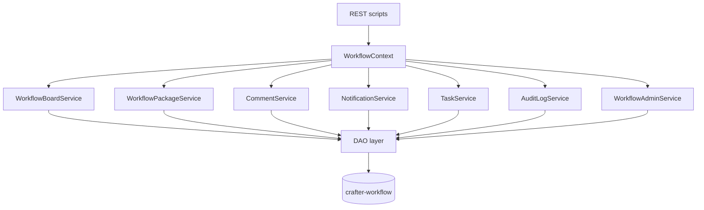

# API Contract

Plugin REST scripts under:

```
/studio/api/2/plugin/script/plugins/org/rd/plugin/crafterwf/crafterwf/
```

All endpoints use **canonical names** only. See [CANONICAL_MODEL.md](./CANONICAL_MODEL.md).

Convention: required `siteId` on every call. Authorization: [AUTHORIZATION.md](./AUTHORIZATION.md).

**HTTP methods:** Crafter Studio plugin REST runs query-parameter mutations via **`*.get.groovy`** (call with HTTP GET). Only `admin/workflow/save` uses **`save.post.groovy`** with a JSON POST body. The UI (`pluginPost` / `pluginDelete`) and curl test harness use GET for all other state-changing endpoints.

**Script layout:** Each endpoint is a Groovy file under `authoring/scripts/rest/plugins/org/rd/plugin/crafterwf/crafterwf/` named `{endpoint}.get.groovy` (reads and most writes) or `{endpoint}.post.groovy` (JSON body save only).

Workflow and step **definitions** are stored in the site repo as JSON ([WORKFLOW_DEFINITIONS.md](./WORKFLOW_DEFINITIONS.md)). Admin and board APIs read/write definitions via `WorkflowDefinitionService`; `workflowId` and step `id` values are stable string slugs (for example `editorial`, `backlog`), not DB UUIDs.

## Workflow and WorkflowSteps

### `workflow/board.json`

Load full kanban view: one **Workflow**, ordered **WorkflowSteps**, and active **WorkflowPackages** per step.

| Param | Required | Description |
|-------|----------|-------------|
| `workflowId` | No | Workflow definition ID (slug); default workflow from JSON (`isDefault` or lowest `position`) |
| `boardId` | No | Legacy alias for `workflowId` |
| `since` | No | Optional ISO timestamp for conditional refresh |

**Response:**

```json
{
  "workflow": {
    "id": "uuid",
    "name": "News Editorial",
    "description": "...",
    "backgroundUrl": "...",
    "position": 0
  },
  "workflowSteps": [
    {
      "id": "in-progress",
      "name": "In Review",
      "position": 1.0,
      "color": "blue",
      "isTerminal": false,
      "workflowPackages": [
        {
          "id": "package-uuid",
          "title": "Q2 Launch",
          "description": "...",
          "position": 1.0,
          "coverColor": "blue",
          "status": "active",
          "attachmentCount": 3,
          "commentCount": 2
        }
      ]
    }
  ]
}
```

### `workflow-step/create.json`

| Param | Description |
|-------|-------------|
| `workflowId` | Parent workflow |
| `name` | WorkflowStep name |
| `position` | Optional; append if omitted |

**Requires:** site admin (see [AUTHORIZATION.md](./AUTHORIZATION.md))

### `workflow-step/update.json`

| Param | Description |
|-------|-------------|
| `workflowStepId` | Step to update |
| `name`, `color`, `isTerminal` | Fields to change |

**Requires:** site admin

### `workflow-step/delete.json`

| Param | Description |
|-------|-------------|
| `workflowStepId` | Step to delete |
| `packageDisposition` | `block` \| `move_to_step` (optional) |
| `targetWorkflowStepId` | Required when `packageDisposition=move_to_step` |

**Requires:** site admin

### `workflow-step/reorder.json`

| Param | Description |
|-------|-------------|
| `workflowId` | Workflow |
| `workflowStepIds` | Ordered list of step IDs |

**Requires:** site admin

## WorkflowPackages

### `workflow-package/create.json`

| Param | Description |
|-------|-------------|
| `workflowStepId` | Target WorkflowStep |
| `title` | Package title |
| `description` | Optional |
| `coverColor` | Optional |

**Requires:** site member

### `workflow-package/move.json`

| Param | Description |
|-------|-------------|
| `workflowId` | Workflow |
| `workflowStepId` | Target WorkflowStep |
| `workflowPackageId` | Package |
| `index` | Target position (0-based) |

**Requires:** site member

On success, returns the moved package DTO. When the target step defines a publish **`actionType`** (not `none`), `WorkflowStepActionService` runs **after** the move against all content attachments (see [WORKFLOW_DEFINITIONS.md](./WORKFLOW_DEFINITIONS.md#step-publish-actions)).

**Optional response fields (step action / rules):**

| Field | When set | Meaning |
|-------|----------|---------|
| `stepActionFailed` | Step `actionType` ran and failed | `true` — publish/request failed; package may be reverted |
| `stepActionSucceeded` | Step action completed | `true` when action ran successfully |
| `message` / `userMessage` | Step action or rule failure | Human-readable error (Studio publish message or rule text) |
| `reverted` | Step action failed after move | `true` if package was moved back to the previous step |
| `workflowStepId` | After move or revert | Resulting step id |
| `moveBlocked` | Step `roleRule` / `contentRule` blocked move | `true` — move did not occur |
| `moveBlockedReason` | With `moveBlocked` | Why the move was rejected |

**Logging:** successful/failed step actions write audit `package_step_action`. Server logs use `[crafterwf]` prefix when invoking Studio `workflowService` (OOTB `EmailMessageSender` errors without `[crafterwf]` are separate — see [NOTIFICATIONS.md](./NOTIFICATIONS.md#email-delivery)).

### `workflow-package/archive.json`

| Param | Description |
|-------|-------------|
| `workflowPackageId` | Package |

Sets `status = archived`. **Requires:** site member

### `workflow-package/get.json`

| Param | Description |
|-------|-------------|
| `workflowPackageId` | Package |

**Response:**

```json
{
  "workflowPackage": {
    "id": "package-uuid",
    "workflowId": "...",
    "workflowStepId": "...",
    "title": "Q2 Launch",
    "description": "...",
    "coverColor": "blue",
    "status": "active"
  },
  "contentRefs": [],
  "links": [],
  "comments": []
}
```

## Attachments

### `workflow-package/attach-content.json`

| Param | Description |
|-------|-------------|
| `workflowPackageId` | Package |
| `contentPath` | Crafter content path |
| `displayName` | Display name |

**Requires:** site member

### `workflow-package/attach-link.json`

| Param | Description |
|-------|-------------|
| `workflowPackageId` | Package |
| `name` | Display name |
| `url` | External URL |

**Requires:** site member

### `workflow-package/remove-attachment.json`

| Param | Description |
|-------|-------------|
| `workflowPackageId` | Package |
| `attachmentId` | Content ref or link ID |
| `attachmentType` | `content` \| `link` |

**Requires:** site member

## Comments

### `comment/list.json`

| Param | Description |
|-------|-------------|
| `targetType` | `workflow_package` \| `content` |
| `targetId` | Package UUID or content path |
| `workflowPackageId` | Legacy alias for package `targetId` |
| `contentPath` | Legacy alias for content `targetId` |
| `includeResolved` | `true` \| `false` (default: true) |
| `includeArchived` | `true` \| `false` (default: false) |

**Requires:** site member

### `comment/create.json`

| Param | Description |
|-------|-------------|
| `targetType` | `workflow_package` \| `content` |
| `targetId` | Package UUID or content path |
| `workflowPackageId` | Legacy alias for package `targetId` |
| `contentPath` | Legacy alias for content `targetId` |
| `body` | Comment text |
| `mentionedUserIds` | Comma-separated Studio user IDs to notify |

Sets `workflow_step_id` from the package’s current step when `targetType=workflow_package`. **Requires:** site member

### `comment/resolve.json`

| Param | Description |
|-------|-------------|
| `commentId` | Comment UUID |
| `resolved` | `true` to resolve, `false` to reopen |

**Requires:** site member

### `comment/archive.json`

| Param | Description |
|-------|-------------|
| `commentId` | Comment UUID |
| `archived` | `true` to archive, `false` to restore |

Archived comments are hidden from default lists and board comment counts.

**Requires:** site member

## Notifications

See [NOTIFICATIONS.md](./NOTIFICATIONS.md).

### `notification/list.json`

| Param | Description |
|-------|-------------|
| `unreadOnly` | `true` \| `false` (default: false) |
| `includeResolved` | `true` \| `false` (default: true) |
| `includeArchived` | `true` \| `false` (default: false) |
| `markDisplayedAsRead` | `true` \| `false` (default: true) — marks listed notifications read when the panel loads them |

Returns `{ notifications: [...] }` for the current user.

### `notification/unread-count.json`

Badge count for current user (unread, non-archived).

### `notification/create.json`

| Param | Description |
|-------|-------------|
| `userId` | Recipient (defaults to current user) |
| `title` | Required |
| `message` | Notification body |
| `targetType` | Optional target type |
| `targetId` | Optional target id |

### `notification/mark-read.json`

| Param | Description |
|-------|-------------|
| `notificationId` | Single notification |
| `markAll` | `true` to mark all read |
| `read` | `true` \| `false` (default: true) |

### `notification/resolve.json`

| Param | Description |
|-------|-------------|
| `notificationId` | Notification UUID |
| `resolved` | `true` to resolve, `false` to reopen |

### `notification/archive.json`

| Param | Description |
|-------|-------------|
| `notificationId` | Notification UUID |
| `archived` | `true` to archive, `false` to restore |

### `notification/preferences/get.json`

Returns current user's delivery preference for the site.

Response: `{ siteId, userId, deliveryMode, summaryTime, emailEnabled, modifiedOn }`.

### `notification/preferences/save.json`

**Primary (UI):** GET query parameters via `save.get.groovy` (same convention as other plugin mutations).

| Param | Required | Description |
|-------|----------|-------------|
| `siteId` | Yes | Site ID |
| `deliveryMode` | No | `immediate` \| `daily_summary` (default: `immediate`) |
| `summaryTime` | No | Optional digest time |
| `emailEnabled` | Yes | `true` \| `false` |

**Alternate:** POST JSON body via `save.post.groovy` with the same fields.

Returns saved preference object (same shape as get).

## Tasks

User tasks with optional links to arbitrary targets (`targetType` / `targetId`). See [TASKS.md](./TASKS.md).

### `task/list.json`

| Param | Description |
|-------|-------------|
| `assigneeId` | Defaults to current user |
| `includeComplete` | `true` \| `false` (default: true) |
| `includeArchived` | `true` \| `false` (default: false) |
| `targetType` | Optional filter |
| `targetId` | Optional filter |
| `allTasks` | `true` to list all tasks for the site (ignores assignee filter). Alias: `scope=all` |

Returns `{ tasks: [...] }`.

Task object fields: `id`, `siteId`, `title`, `priority` (`high` \| `medium` \| `low`), `assigneeId`, `assigneeUsername`, `dueOn`, `complete`, `archived`, `targetType`, `targetId`, `targetTitle`, `targetWorkflowId`, `createdOn`, `modifiedOn`, `completedOn`.

### `task/get.json`

| Param | Description |
|-------|-------------|
| `taskId` | Required |

Returns a single task DTO.

### `task/open-count.json`

Open (incomplete, non-archived) task count for badge display.

**Response:** `{ openCount, overdueCount }` — badge turns red when `overdueCount > 0`.

### `task/create.json`

| Param | Description |
|-------|-------------|
| `title` | Required |
| `priority` | `high` \| `medium` \| `low` (default: medium) |
| `dueOn` | ISO date or `yyyy-MM-dd` |
| `assigneeId` | Defaults to current user |
| `assigneeUsername` | Defaults to current username |
| `targetType` | Optional |
| `targetId` | Optional |

### `task/update.json`

| Param | Description |
|-------|-------------|
| `taskId` | Required |
| `title`, `priority`, `dueOn`, `assigneeId`, `assigneeUsername`, `targetType`, `targetId` | Optional updates |

### `task/complete.json`

| Param | Description |
|-------|-------------|
| `taskId` | Required |
| `complete` | `true` \| `false` (default: true) |

### `task/archive.json`

| Param | Description |
|-------|-------------|
| `taskId` | Required |
| `archived` | `true` \| `false` (default: true) |

## Audit log

See [AUDIT_LOG.md](./AUDIT_LOG.md).

### `audit/list.json`

| Param | Description |
|-------|-------------|
| `username` | Filter by username |
| `operation` | e.g. `task_created`, `task_modified`, `package_created`, `package_step_changed` |
| `targetType` | `task`, `package`, `workflow` |
| `targetId` | Exact target ID |
| `q` / `query` | Search note, username, target_id, operation |
| `from`, `to` | Date range |
| `page`, `pageSize` | Pagination |

**Response:** `{ entries, total, page, pageSize, totalPages, hasNextPage, hasPreviousPage }`

## Administration

### `admin/schema/status.json`

Returns `{ installed, schemaName, version }`.

### `admin/schema/install.json`

Runs schema migration to latest version.

### `admin/workflow/list.json`

List workflows for site with step/package counts.

### `admin/workflow/get.json`

| Param | `workflowId` |

### `admin/workflow/create.json`

| Param | Description |
|-------|-------------|
| `name`, `description` | Workflow metadata |
| `withDefaultSteps` | `true` to provision Backlog / In Progress / Done |

### `admin/workflow/save.post.json`

POST body: `{ siteId, workflowId, workflow, steps }`.

**`workflow` fields (root):** `id`, `name`, `description`, `backgroundUrl`, `position`, `isDefault`, `allowUiBypass`, `bypassWarningMessage`, `createListeners`, `editListeners`.

**Each `steps[]` entry:** `id`, `name`, `position`, `color`, `isTerminal`, `allowAddPackage`, **`actionType`** (`none` \| `request_publish_staging` \| `request_publish_live` \| `publish_staging` \| `publish_live`), **`actionSuccessStepId`**, `roleRule`, `contentRule`.

See [WORKFLOW_DEFINITIONS.md](./WORKFLOW_DEFINITIONS.md) for field semantics and [WORKFLOW_BYPASS_GUARD.md](./WORKFLOW_BYPASS_GUARD.md) for `allowUiBypass`.

### `admin/publishing/targets.json`

Returns `{ stagingEnabled, staging, live }` environment names for the site (used by the workflow editor and step action service).

### `admin/workflow/delete.json`

| Param | `workflowId` |

### `workflow-bypass/check.json`

| Param | Description |
|-------|-------------|
| `contentPaths` | Comma-separated content store paths |
| `action` | `publish` \| `request_publish` \| `reject` |

Returns `{ requiresAcknowledgement, violations[] }` when content is in an active package off an action step.

### `workflow-bypass/acknowledge.json` (POST)

Body: `{ siteId, action, violations[] }` — records `workflow_bypass_acknowledged` audit entries.

### `workflow-bypass/record-action.json` (POST)

Body: `{ siteId, action, violations[] }` — records `workflow_bypass_action` audit entries and sends notifications.

## Error responses

| Code | Meaning |
|------|---------|
| 403 | Not authorized for site or operation |
| 404 | Entity not found or wrong `site_id` |
| 409 | Conflict (e.g. delete step with packages and `packageDisposition=block`) |
| 422 | Validation error |

## Service layer (internal)



See [ARCHITECTURE_DIAGRAM.md](./ARCHITECTURE_DIAGRAM.md) for the full implementation stack.

## Deferred endpoints

These may be added later:

- `admin/roles/*` — per-workflow WorkflowRole

## Superseded by this spec

| Old (removed) | New |
|----------------------|-----|
| `board/lists.json` | `workflow/board.json` |
| `stage/*` | `workflow-step/*` (via board payload) |
| `card/*` | `workflow-package/*` |
| Trello webhooks / hook console | Removed |
