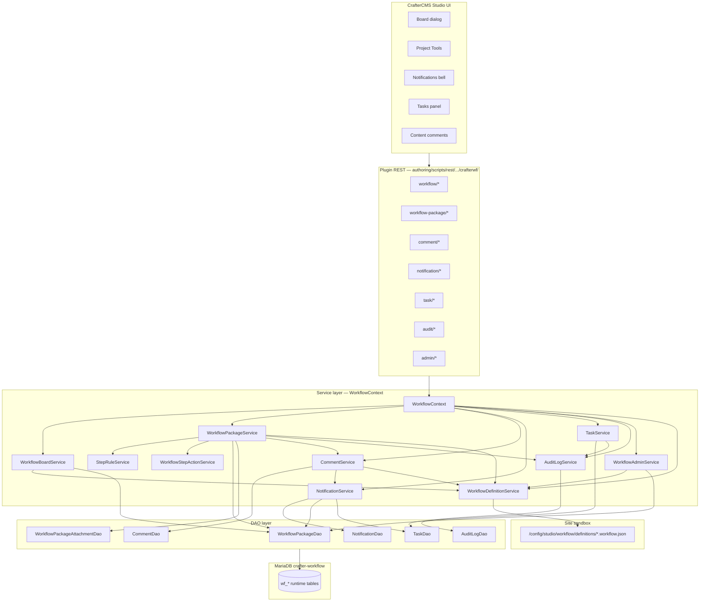
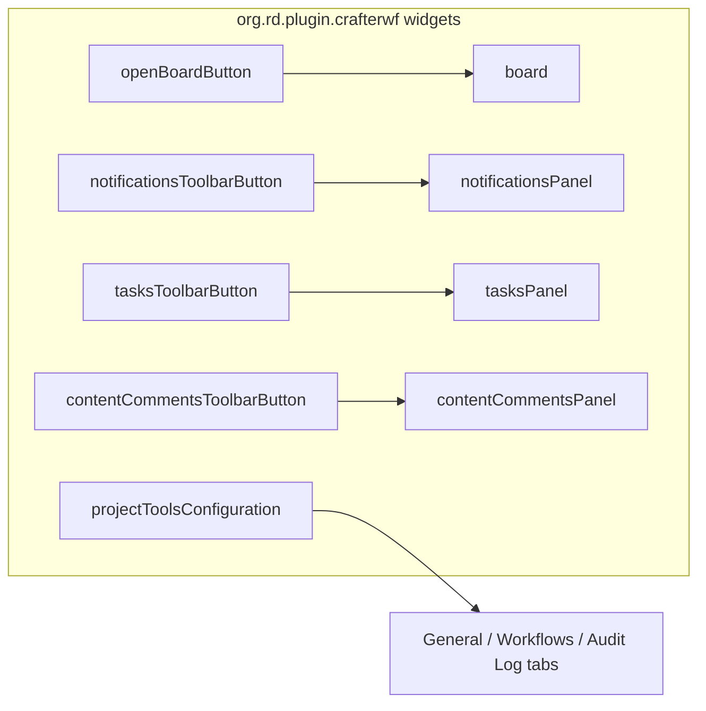
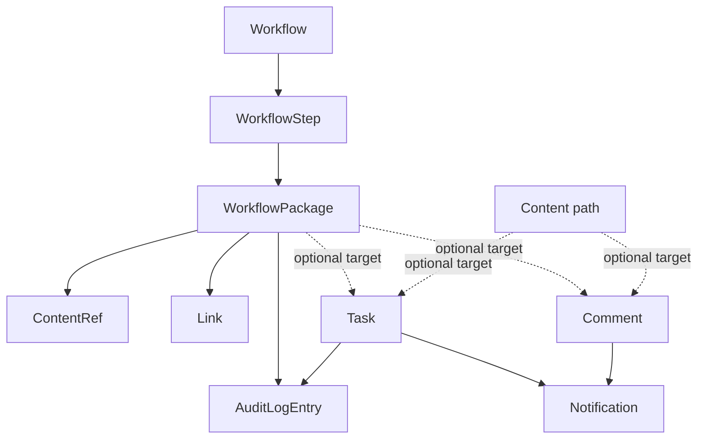
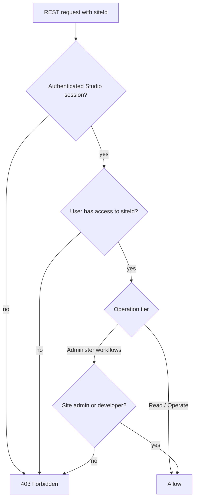
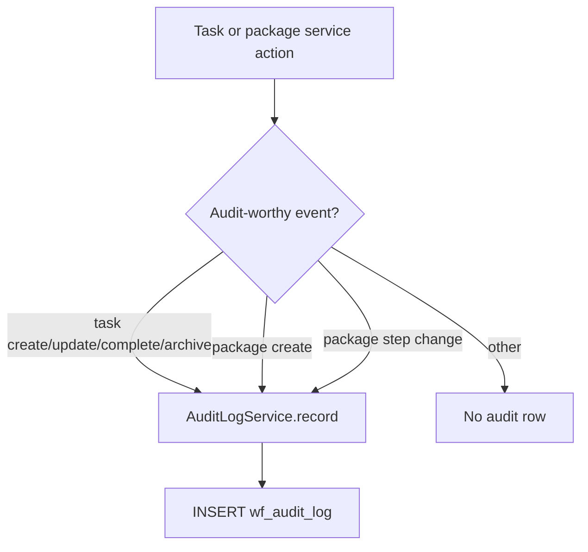
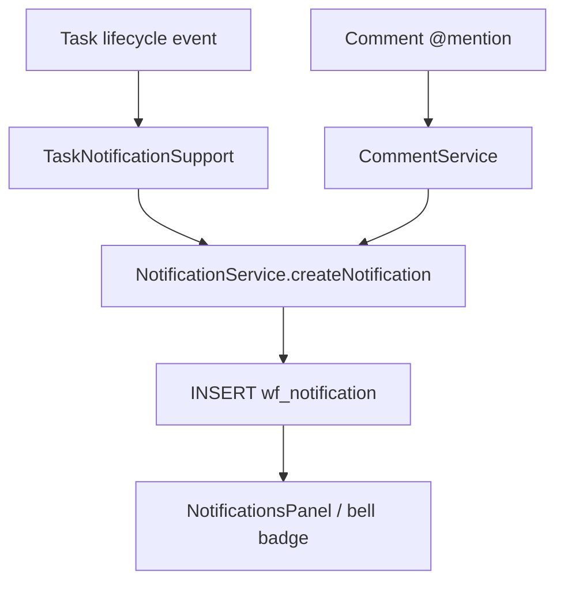
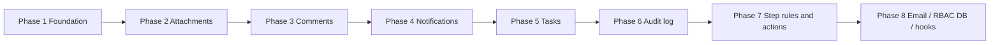
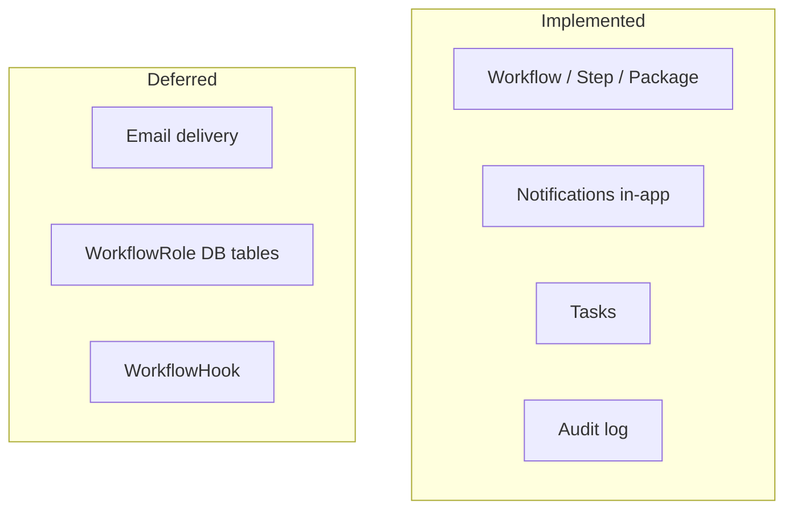
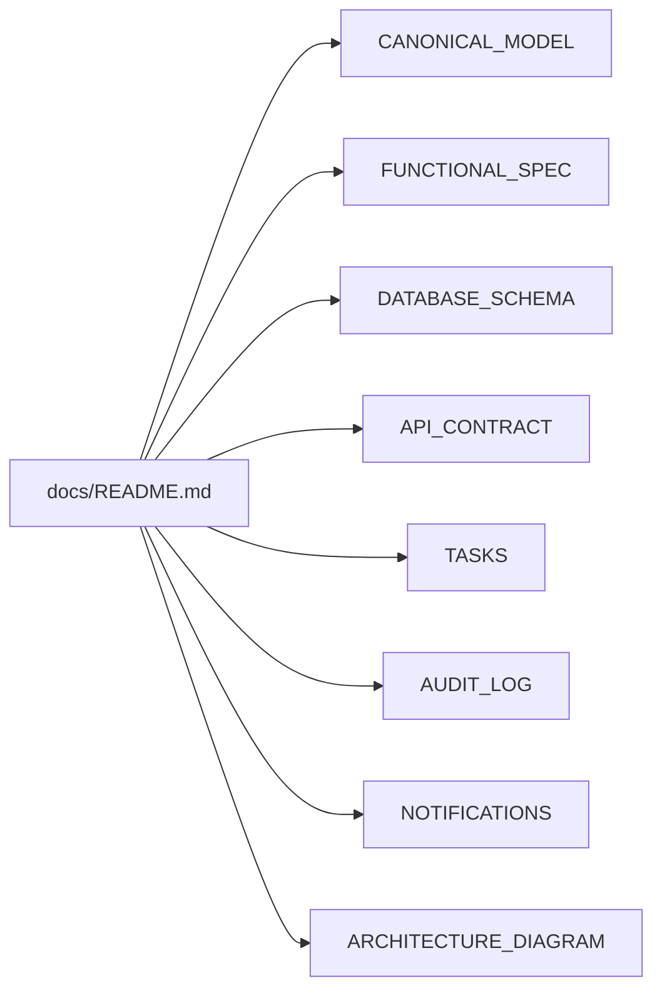

# Architecture Diagrams

Visual reference for the Crafter Workflow plugin. All diagrams use [Mermaid](https://mermaid.js.org/).

## Implementation stack

## Studio widgets

## Domain model (canonical entities)

Workflow-owned data (solid) vs independent collaboration entities (dashed optional links):

## Authorization flow

Per-workflow RBAC (`WorkflowRole`) is **deferred**. See [AUTHORIZATION.md](./AUTHORIZATION.md).

## Audit recording flow

## Notification flow (implemented)

Email branch is **not implemented** — see [NOTIFICATIONS.md](./NOTIFICATIONS.md).

## Schema migrations

```mermaid
flowchart LR
    V1[V001 Core] --> V2[V002 Comments]
    V2 --> V3[V003 Comment archive]
    V3 --> V4[V004 Notifications]
    V4 --> V5[V005 Tasks]
    V5 --> V6[V006 Audit log]
    V6 --> V7[V007 Step actions]
    V7 --> V8[V008 Action type]
    V8 --> V9[V009 allowAddPackage]
    V9 --> V10[V010 Package due_on]
    V10 --> V11[V011 Task start_on]
    V11 --> V12[V012 Content type + legacy step rules]
```

Current target: **V12**. See [DATABASE_SCHEMA.md](./DATABASE_SCHEMA.md).

## Implementation phases

| Phase | Status |
|-------|--------|
| 1 — Foundation | ✅ |
| 2 — Attachments | ✅ |
| 3 — Comments | ✅ |
| 4 — Notifications (in-app) | ✅ |
| 5 — Tasks | ✅ |
| 6 — Audit log | ✅ |
| 7 — Step rules, publish actions, calendar | ✅ |
| 8 — Email, hooks, WorkflowRole (DB) | ❌ deferred |

## Deferred (future)

## Document map

## Related documents

- [CANONICAL_MODEL.md](./CANONICAL_MODEL.md)
- [DATABASE_SCHEMA.md](./DATABASE_SCHEMA.md)
- [FUNCTIONAL_SPEC.md](./FUNCTIONAL_SPEC.md)
- [API_CONTRACT.md](./API_CONTRACT.md)
