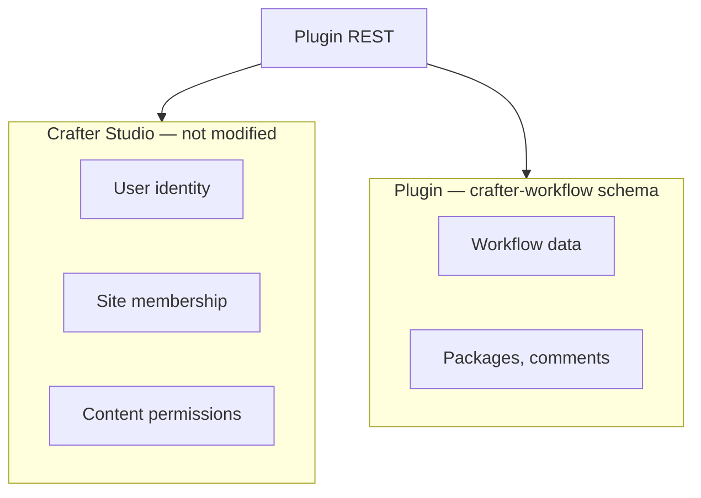

# Authorization

Access control uses **Crafter Studio site roles and content permissions only**. The plugin does **not** store workflow capabilities in the database or modify `permissions.xml`.

Per-workflow role tables (`WorkflowRole`, etc.) are **deferred** — see [CANONICAL_MODEL.md](./CANONICAL_MODEL.md).

## Separation of concerns

| Layer | Source | Plugin modifies? |
|-------|--------|------------------|
| User identity | Studio user account | No |
| Site membership | Studio groups → role mappings | No |
| Content/repo permissions | `permission-mappings-config.xml` | **No** |
| Workflow plugin data | `` `crafter-workflow` `` | **Yes** (workflows, packages, comments — not permissions) |

## Current phase: Studio roles only

Every REST call:

1. Requires an authenticated Studio session
2. Validates `siteId` matches the active site
3. Ensures the user has access to that site (standard Studio site membership)

### Operation tiers (logical)

| Tier | Operations | Suggested gate (implementation TBD) |
|------|------------|-------------------------------------|
| **Read** | Open board, view packages, list comments | Any site member |
| **Operate** | Create/move/archive packages, attach content/links, add/resolve comments | Any site member with content access |
| **Administer** | Create/rename/delete/reorder WorkflowSteps, edit workflow metadata | Site `admin` (or `developer`) |

Crafter content actions (Publish, Request Review, Reject) remain governed by Studio content permissions and `availableActionsMap` — unchanged.

## What we avoid

| Approach | Why not |
|----------|---------|
| Workflow permissions in `permission-mappings-config.xml` | Cannot modify site config |
| Capabilities in git site files | Not per-workflow |
| Storing Crafter `availableActionsMap` in plugin DB | Must stay live from Studio |

## Future: per-workflow capabilities

A later phase may introduce `WorkflowRole` (Studio role → capability flags per workflow). Not in scope now.

## Related documents

- [CANONICAL_MODEL.md](./CANONICAL_MODEL.md) — deferred entities
- [API_CONTRACT.md](./API_CONTRACT.md) — endpoints
