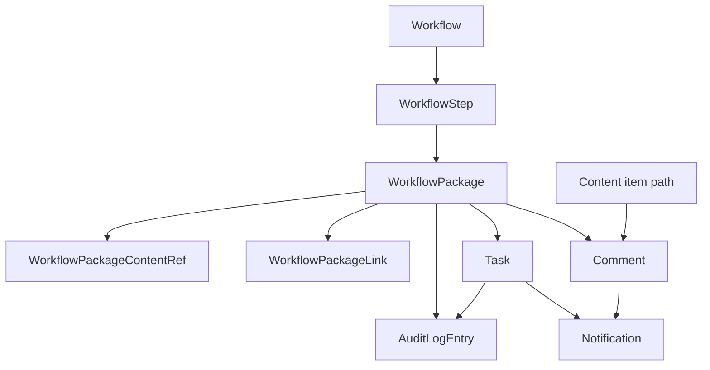

# Canonical Model

Authoritative names for the Crafter Workflow domain. Use these in code, database tables, API, and UI.

## Entity glossary

| Canonical name | Former names | Description |
|----------------|--------------|-------------|
| **Workflow** | Board | A named editorial process for a site. Contains ordered **WorkflowSteps**. |
| **WorkflowStep** | List, Stage, Column | One step in a workflow. WorkflowPackages sit in exactly one step at a time. |
| **WorkflowPackage** | Card, Package | A unit of work moving through workflow steps. Holds content refs, external links, comments, and tasks. |
| **WorkflowPackageContentRef** | Content attachment | Reference to a Crafter CMS content item (sandbox path). |
| **WorkflowPackageLink** | Document attachment | External URL attached to a package. |
| **Comment** | WorkflowPackageComment | User comment on a **target** (`workflow_package` or `content`). Package comments capture step snapshot. |
| **Task** | — | Assignable work item with optional `target_type` / `target_id` link. |
| **Notification** | — | In-app alert to a Studio user. See [NOTIFICATIONS.md](./NOTIFICATIONS.md). |
| **AuditLogEntry** | — | Append-only audit record. See [AUDIT_LOG.md](./AUDIT_LOG.md). |

## Relationships

- A **Workflow** contains ordered **WorkflowSteps**.
- A **WorkflowPackage** belongs to one **WorkflowStep** at a time (and one **Workflow**).
- Moving a package changes its **WorkflowStep** and position within that step.
- **Comments** attach to a generic target (`target_type`, `target_id`), not only packages.
- **Tasks** optionally link to any target (commonly `workflow_package` or `content`).
- **AuditLogEntry** records selected task and package lifecycle events.

## WorkflowPackage contents

| Child | Purpose |
|-------|---------|
| **Content references** | Crafter content paths (pages, components, assets) |
| **External links** | Non-CMS URLs (docs, tickets, etc.) |
| **Comments** | Discussion thread (via generic `wf_comment`) |
| **Tasks** | Assignable work items linked to the package |

## Comment

Comments are stored in **`wf_comment`** with polymorphic targets.

| Attribute | Description |
|-----------|-------------|
| **target_type** | `workflow_package` or `content` |
| **target_id** | Package UUID or content path |
| **Author** | `author_id`, optional `author_username` snapshot |
| **Created at** | `created_on` |
| **WorkflowStep at comment time** | `workflow_step_id` snapshot for package comments only |
| **Body** | Comment text; supports `@username` mentions |
| **Resolved** | `resolved_on`, `resolved_by`; `NULL` = open |
| **Archived** | `archived_on`, `archived_by`; hidden from default lists when set |

### Comment rules

1. **Step snapshot:** For `workflow_package` targets, `workflow_step_id` is set at create time from the package’s current step.
2. **Mentions:** `@username` in body can notify mentioned users (via `mentionedUserIds` on create API).
3. **Resolution / archive:** Both are reversible.

## WorkflowStep.is_terminal

Boolean flag (`is_terminal`) marking a step as a completion/done column. Default **Done** step is created with `isTerminal: true`. **Not yet consumed** by board behavior (no auto-archive, publish gate, or visual indicator).

## Definition vs runtime storage

| Canonical entity | Definition (git) | Runtime (MariaDB) |
|------------------|------------------|-------------------|
| **Workflow** | `{workflowId}.workflow.json` under `/config/studio/workflow/definitions/` | — (metadata not stored in DB) |
| **WorkflowStep** | `steps[]` in the same JSON file | — (step IDs referenced by packages) |
| **WorkflowPackage** | — | `wf_workflow_package` (`workflow_id`, `workflow_step_id` = definition slugs) |

See [WORKFLOW_DEFINITIONS.md](./WORKFLOW_DEFINITIONS.md).

## Database table mapping

| Canonical entity | Table name | Notes |
|------------------|------------|-------|
| Workflow | `wf_workflow` | **Legacy** — definitions use JSON; table unused for CRUD |
| WorkflowStep | `wf_workflow_step` | **Legacy** — step config lives in JSON |
| WorkflowPackage | `wf_workflow_package` | Active |
| WorkflowPackageContentRef | `wf_workflow_package_content_ref` |
| WorkflowPackageLink | `wf_workflow_package_link` |
| Comment | `wf_comment` |
| Task | `wf_task` |
| Notification | `wf_notification` |
| User notification preference | `wf_user_notification_preference` |
| AuditLogEntry | `wf_audit_log` |
| Schema version | `wf_schema_version` |

## Out of scope (deferred)

| Deferred | Description |
|----------|-------------|
| Per-workflow role capabilities | `WorkflowRole`, `SiteRoleTemplate` (DB tables) |
| Groovy hooks | Post-commit `package.moved` / `package.modified` scripts |
| Email notification delivery | Preference table exists; send logic not implemented |

**Implemented (not deferred):** Step **roleRule** / **contentRule** and publish **actionType** on definition JSON — enforced by `StepRuleService` and `WorkflowStepActionService`. See [WORKFLOW_DEFINITIONS.md](./WORKFLOW_DEFINITIONS.md).

May be added without renaming core entities.

## Historical names (reference only)

The original Trello-based plugin used different terms. All REST APIs use canonical `workflow-package/*` paths; legacy `card/*`, `board/lists`, and Trello webhook endpoints were removed.

| Historical | Canonical |
|------------|-----------|
| Board | Workflow |
| List / Stage | WorkflowStep |
| Card | WorkflowPackage |

## Related documents

- [DATABASE_SCHEMA.md](./DATABASE_SCHEMA.md)
- [FUNCTIONAL_SPEC.md](./FUNCTIONAL_SPEC.md)
- [API_CONTRACT.md](./API_CONTRACT.md)
- [TASKS.md](./TASKS.md)
- [AUDIT_LOG.md](./AUDIT_LOG.md)
- [NOTIFICATIONS.md](./NOTIFICATIONS.md)
- [WORKFLOW_DEFINITIONS.md](./WORKFLOW_DEFINITIONS.md)
- [ARCHITECTURE_DIAGRAM.md](./ARCHITECTURE_DIAGRAM.md)
