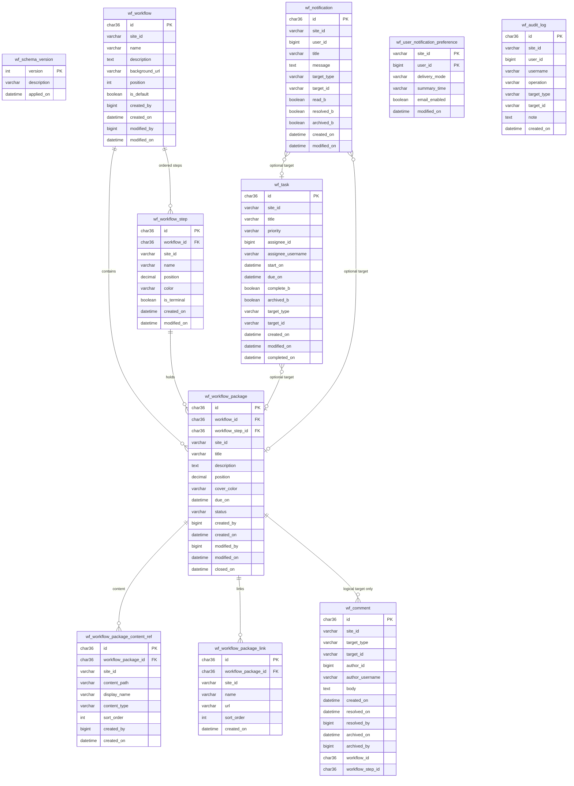
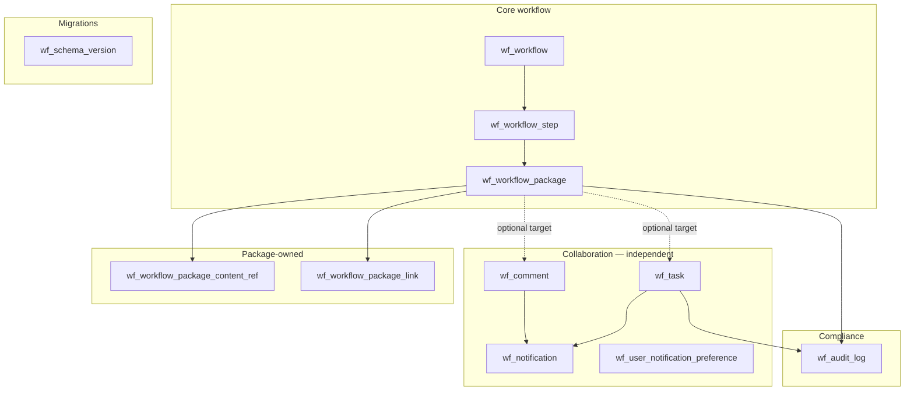
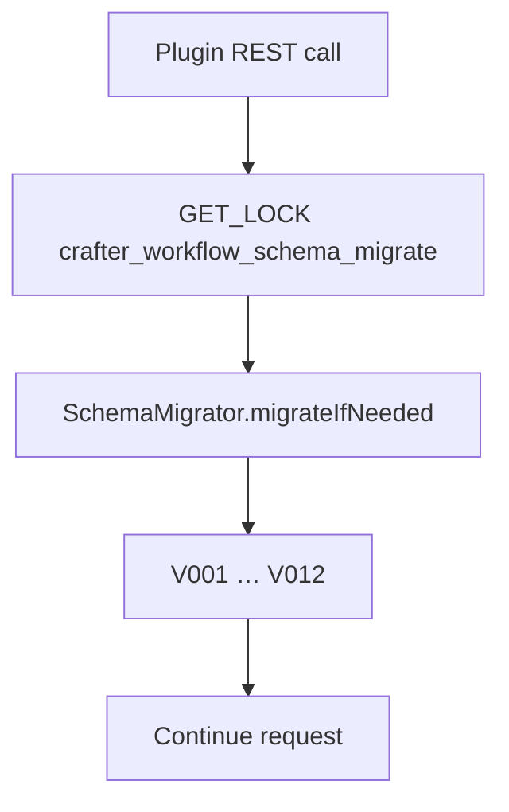

# Database Schema — `crafter-workflow`

All plugin data lives in a dedicated MariaDB schema alongside Studio's `crafter` schema. Studio schema is **never modified**.

Canonical entity names: [CANONICAL_MODEL.md](./CANONICAL_MODEL.md).

## Schema isolation

| Item | Value |
|------|--------|
| Schema name | `` `crafter-workflow` `` (hardcoded in `WorkflowDb`) |
| DB user | Same as Studio (`crafter` or equivalent) |
| Table references | Fully qualified: `` `crafter-workflow`.wf_workflow `` |
| Latest version | **12** (`SchemaMigrator.LATEST_SCHEMA_VERSION`) |

### Database privileges

The Studio JDBC user needs privileges on `` `crafter-workflow` ``:

```bash
./scripts/grant-workflow-schema.sh
```

### Multi-tenancy

Every tenant-scoped table includes `site_id`. All queries **must** filter by `site_id` from the authenticated Studio request.

### Workflow definitions (not in this schema)

Workflow and step **definitions** are stored in the site repository as JSON under `/config/studio/workflow/definitions/`, not in `wf_workflow` / `wf_workflow_step`. Those tables remain for backward compatibility and historical migrations; the plugin reads and writes definitions via `WorkflowDefinitionService` and `contentService`. Package rows reference definition IDs in `workflow_id` and `workflow_step_id`. See [WORKFLOW_DEFINITIONS.md](./WORKFLOW_DEFINITIONS.md).

## Entity-relationship diagram



> **Note:** `wf_comment` and `wf_task` associate with packages through `target_type` + `target_id` only — **no foreign key**. Content-path comments (`target_type=content`) have no workflow relationship.

## Logical grouping

Collaboration tables are **peers** of the workflow core — not child tables of `wf_workflow_package`.



## Table reference

### `wf_workflow`

A **Workflow** (kanban board definition).

### `wf_workflow_step`

**Legacy table** — step definitions live in site JSON ([WORKFLOW_DEFINITIONS.md](./WORKFLOW_DEFINITIONS.md)). Columns from V007–V012 remain for upgraded databases but are not written by current definition CRUD.

| Column | Notes |
|--------|-------|
| `position` | `DECIMAL(20,10)` for insert-between ordering |
| `is_terminal` | “Done” step flag; stored in JSON; no auto-archive behavior yet |
| V007–V008 | Legacy publish-action booleans / `step_action_type`, `step_action_success_step_id` |
| V009 | `allow_add_package` (superseded by JSON `allowAddPackage`) |
| V012 | `role_rule_*`, `content_rule_*` (superseded by JSON `roleRule` / `contentRule`) |

### `wf_workflow_package`

A **WorkflowPackage** in one step at a time.

| Column | Notes |
|--------|-------|
| `workflow_step_id` | Current step (definition slug) |
| `due_on` | Optional due date (V010); used by calendar |
| `status` | `active` \| `archived` |

### `wf_workflow_package_content_ref` / `wf_workflow_package_link`

Crafter content paths and external URLs linked to a package.

| Column | Notes |
|--------|-------|
| `content_type` | Resolved Crafter content type path (V012); used by step content rules |

### `wf_comment`

Generic **Comment** targets (`workflow_package`, `content`).

| Column | Notes |
|--------|-------|
| `target_type`, `target_id` | Polymorphic target |
| `workflow_step_id` | Step snapshot for package comments |
| `resolved_on`, `archived_on` | Resolution and archive |

> **Note:** `wf_workflow_package_comment` was migrated to `wf_comment` in V002 and dropped.

### `wf_notification` / `wf_user_notification_preference`

See [NOTIFICATIONS.md](./NOTIFICATIONS.md).

### `wf_task`

See [TASKS.md](./TASKS.md).

### `wf_audit_log`

See [AUDIT_LOG.md](./AUDIT_LOG.md).

### `wf_schema_version`

Plugin migration version tracking.

## Schema evolution

| Version | Migration | Description |
|---------|-----------|-------------|
| 1 | V001 | Core workflow, package, comment, notification tables |
| 2 | V002 | Generic `wf_comment`; migrate from package-only comments |
| 3 | V003 | `archived_on`, `archived_by` on comments |
| 4 | V004 | Replace notification table with target-based model |
| 5 | V005 | `wf_task` |
| 6 | V006 | `wf_audit_log` |
| 7 | V007 | Legacy step publish-action flags on `wf_workflow_step` |
| 8 | V008 | `step_action_type`, `step_action_success_step_id` on `wf_workflow_step` |
| 9 | V009 | `allow_add_package` on `wf_workflow_step` |
| 10 | V010 | `due_on` on `wf_workflow_package` + calendar index |
| 11 | V011 | `start_on` on `wf_task` |
| 12 | V012 | `content_type` on content refs; legacy step rule columns on `wf_workflow_step` |

Migrations are applied in `SchemaMigrator.groovy` (embedded SQL, not separate `.sql` files).



Lazy migrate on first API call. Install explicitly via **Project Tools → General** or `admin/schema/install.json` (HTTP GET).

## Deferred tables (future)

- `wf_workflow_role`, `wf_site_role_template` — per-workflow capabilities beyond JSON step `roleRule`
- `wf_workflow_hook` — Groovy hook registry

## Prior design draft names (do not use)

| Draft name | Canonical table |
|------------|-------------------|
| `wf_stage` | `wf_workflow_step` |
| `wf_package` | `wf_workflow_package` |
| `wf_workflow_package_comment` | `wf_comment` |

## Related documents

- [CANONICAL_MODEL.md](./CANONICAL_MODEL.md)
- [TASKS.md](./TASKS.md)
- [AUDIT_LOG.md](./AUDIT_LOG.md)
- [NOTIFICATIONS.md](./NOTIFICATIONS.md)
