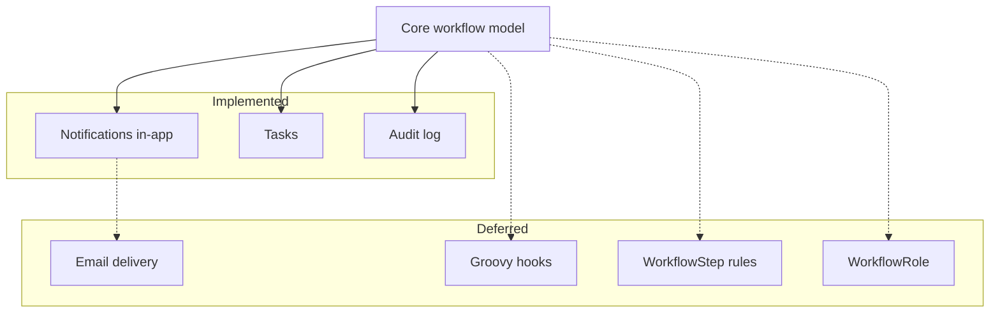

# Extensions

Cross-cutting features beyond the core workflow aggregate.

## Implemented

| Feature | Document | Status |
|---------|----------|--------|
| **Notifications (in-app)** | [NOTIFICATIONS.md](./NOTIFICATIONS.md) | ✅ Bell widget, panel, task/comment/@mention triggers |
| **Tasks** | [TASKS.md](./TASKS.md) | ✅ Tasks panel, package tasks, assignee notifications |
| **Audit log** | [AUDIT_LOG.md](./AUDIT_LOG.md) | ✅ Task + package events; Project Tools tab |

## Deferred

| Feature | Description |
|---------|-------------|
| **Email notifications** | `wf_user_notification_preference` table exists; immediate/digest send not implemented |
| **Groovy hooks** | Post-commit `package.moved` / `package.modified` scripts (not implemented) |
| **WorkflowStep rules** | Pre-move constraints (HTTP 409) |
| **WorkflowRole** | Per-workflow Studio role → capabilities |
| **Terminal step behavior** | `is_terminal` flag stored but not enforced in board logic |

## Related documents

- [DATABASE_SCHEMA.md](./DATABASE_SCHEMA.md)
- [NOTIFICATIONS.md](./NOTIFICATIONS.md)
- [TASKS.md](./TASKS.md)
- [AUDIT_LOG.md](./AUDIT_LOG.md)
