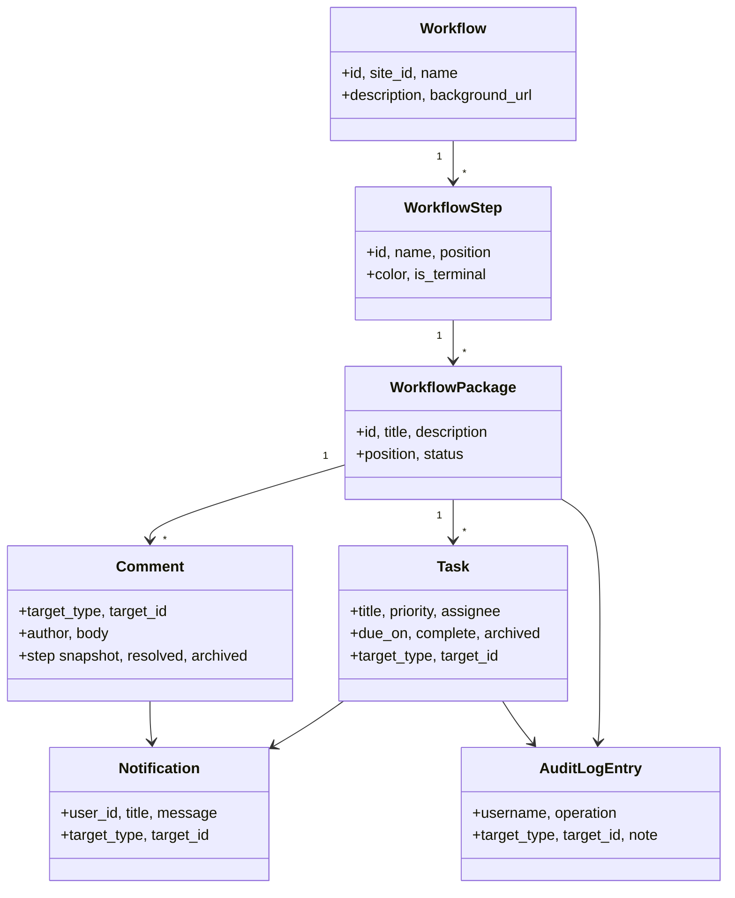

# Functional Specification

Description of the Crafter Workflow plugin as implemented. Canonical names: [CANONICAL_MODEL.md](./CANONICAL_MODEL.md).

## Purpose

Provide a **visual workflow board inside CrafterCMS Studio** so editorial teams can:

- Define workflow steps by creating and arranging **WorkflowSteps** (kanban columns)
- Track work as **WorkflowPackages** moving between steps
- Link CrafterCMS content (pages, components, assets) to packages
- Attach **external links** to packages
- Discuss work via **comments** on packages and content paths
- Assign and track **tasks** with due dates and priorities
- Receive **in-app notifications** for task and mention events
- Review an **audit log** of task and package actions
- Perform CrafterCMS workflow actions (request review, reject, publish) on linked content
- Open linked content via deep links back into Studio preview/edit
- Administer workflows via **Project Tools**

The plugin is **Studio-only**. It does not render boards on the delivery site or define Crafter content types.

## Actors

| Actor | Role |
|-------|------|
| **Content author** | Uses board, moves packages, links content, comments, tasks |
| **Workflow admin** | Manages workflows and steps in Project Tools |
| **Site administrator** | Installs plugin, runs schema migration, grants DB privileges |
| **CrafterCMS Studio** | Hosts UI, content APIs, workflow dialogs, plugin REST scripts |

## Domain model

Crafter workflow state (`availableActionsMap`) is read at action time from linked content — **not** mirrored in the plugin database.

## Core capabilities

### C1 — Workflow board presentation

- Tools panel button opens kanban dialog
- Multiple workflows per site via widget `workflowId` or default workflow
- Drag-and-drop **WorkflowPackages** between **WorkflowSteps**
- Package detail: description, attachments, comments, tasks

### C2 — WorkflowPackage lifecycle

| Action | Behavior |
|--------|----------|
| Create | Title + description in a chosen WorkflowStep; audit `package_created` |
| Move | Drag or API; audit `package_step_changed` when step changes |
| Archive | Soft close (`status = archived`) |
| View details | Description, content refs, links, comments, tasks |

### C3 — Content and link attachments

From a package action menu:

1. **New page** — new-content dialog; on save, attach to package
2. **New component** — same, rooted at `/site/components`
3. **Existing content** — Site Search select mode
4. **External link** — URL with display name
5. **Remove attachment** — detach content ref or link

### C4 — Comments

| Action | Behavior |
|--------|----------|
| Add comment | On `workflow_package` or `content` target; step snapshot for packages |
| @mention | Autocomplete; notifies mentioned users |
| List / resolve / archive | Standard CRUD; archived hidden from default counts |

### C5 — Content preview

Deep link opens Studio preview by content type.

### C6 — CrafterCMS workflow actions

Package menu exposes Request Review, Reject, Publish based on linked items' `availableActionsMap`. Uses standard Studio dialogs.

### C7 — Notifications (in-app)

| Trigger | Recipient |
|---------|-----------|
| Task assigned / updated / completed / archived | Assignee (not actor) |
| Comment `@mention` | Mentioned users |

Bell widget with unread count; panel with navigation to package, task, or content preview.

**Email:** deferred — see [NOTIFICATIONS.md](./NOTIFICATIONS.md).

### C8 — Tasks

- Create from Tasks panel or package detail
- Assignee picker, priority, due date, inline edit
- Optional link to `workflow_package` or `content`
- Toolbar badge: open count; red when overdue
- See [TASKS.md](./TASKS.md)

### C9 — Audit log

- Records task create/modify and package create/step-change
- Project Tools → **Audit Log** tab with filters and pagination
- See [AUDIT_LOG.md](./AUDIT_LOG.md)

### C10 — Project Tools administration

| Tab | Purpose |
|-----|---------|
| **General** | Schema status and install |
| **Workflows** | Create, edit, delete workflows; edit steps (name, color, terminal flag) |
| **Audit Log** | Search audit history |

### C11 — Content comments panel

Separate Tools panel widget for commenting on the currently selected content item in Studio.

## Studio widgets

| Widget ID | Purpose |
|-----------|---------|
| `openBoardButton` | Open kanban dialog |
| `board` | Kanban board component |
| `notificationsToolbarButton` / `notificationsPanel` | Notification bell and inbox |
| `tasksToolbarButton` / `tasksPanel` | Tasks list |
| `contentCommentsToolbarButton` / `contentCommentsPanel` | Content-scoped comments |
| `projectToolsConfiguration` | Project Tools admin (General, Workflows, Audit Log) |

## User workflows

### Open and use a workflow board

1. Author clicks Tools panel workflow button
2. Board loads via `workflow/board.json`
3. Author drags packages, adds packages, opens details, comments, tasks

### Move package between WorkflowSteps

1. Drag-and-drop or API move
2. If step changes, audit entry and DB update (no step rules yet)

## Configuration

- MariaDB schema: `` `crafter-workflow` ``
- Per-widget `ui.xml`: `title`, `icon.id`, `workflowId`
- Schema migration via Project Tools or lazy on first REST call

## CrafterCMS integration

| Integration | Usage |
|-------------|-------|
| `@craftercms/studio-ui` | Widgets, dialogs, content APIs |
| Studio site roles | Site membership (admin for workflow config) |
| `availableActionsMap` | Conditional publish/review menu |
| `userService` | Resolve user IDs for notifications and audit |
| Plugin REST scripts | All workflow operations |
| MariaDB | Schema `` `crafter-workflow` `` |

## Out of scope

- Modifying Crafter Studio schema or `permissions.xml`
- Mandatory content lifecycle workflow (100% page enrollment, content locks, publication gates)
- Content-item status machine (Draft / In Review / Approved on every page)
- Four-Eyes Principle enforcement
- Email notification delivery (designed, not shipped)
- Groovy hooks invocation, WorkflowStep rules, per-workflow WorkflowRole
- Terminal step runtime behavior (`is_terminal` is metadata only)

See [POTENTIAL_REQUIREMENTS.md](./POTENTIAL_REQUIREMENTS.md) for stakeholder PDF gap analysis.

## Related documents

- [API_CONTRACT.md](./API_CONTRACT.md)
- [AUTHORIZATION.md](./AUTHORIZATION.md)
- [TASKS.md](./TASKS.md)
- [AUDIT_LOG.md](./AUDIT_LOG.md)
- [NOTIFICATIONS.md](./NOTIFICATIONS.md)
- [ARCHITECTURE_DIAGRAM.md](./ARCHITECTURE_DIAGRAM.md)
