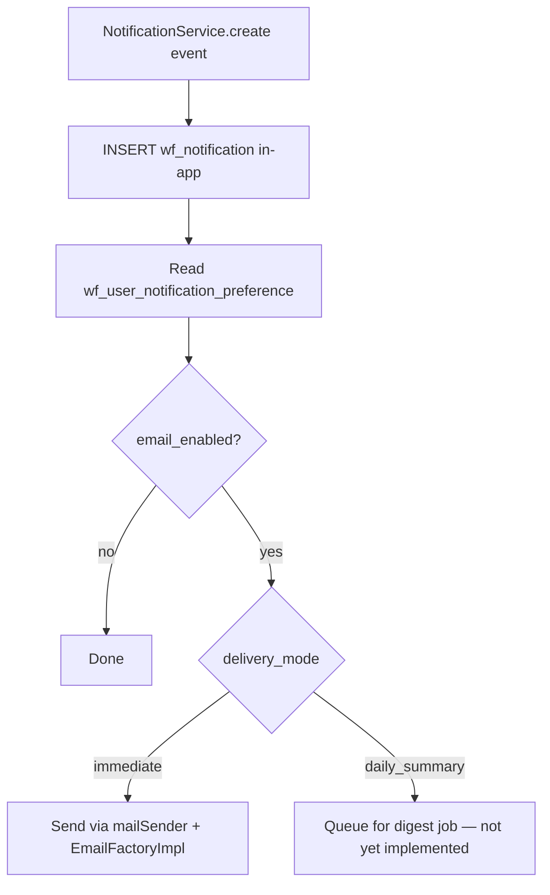

# Notifications

How workflow events reach users via **in-app** inbox and optional **email** in the Studio Tools panel.

## Channels

| Channel | Status |
|---------|--------|
| **In-app** | ✅ Persistent inbox, bell badge, clickable navigation to package/task/content |
| **Email** | ✅ Immediate delivery via Studio `mailSender` (direct send); custom HTML templates |

Every notifiable event creates an **in-app** row in `wf_notification`.

## Model: `wf_notification`

| Column | Notes |
|--------|-------|
| `id` | UUID |
| `site_id` | Crafter site |
| `user_id` | Recipient Studio user ID |
| `title` | Short headline |
| `message` | Body text |
| `target_type` | e.g. `task`, `workflow_package`, `content` |
| `target_id` | Target entity ID or content path |
| `read_b` | `0` = unread |
| `resolved_b` | User-resolved flag |
| `archived_b` | Hidden from default lists when set |
| `created_on`, `modified_on` | Timestamps |

List API enriches notifications with navigation context where possible: `targetTitle`, `targetWorkflowId`, `targetPackageId`.

### User preference: `wf_user_notification_preference`

| Column | Notes |
|--------|-------|
| `delivery_mode` | `immediate` \| `daily_summary` (`daily_summary` stored but digest job not yet implemented) |
| `summary_time` | Optional digest time (for future daily summary) |
| `email_enabled` | Master email toggle — when true and mode is `immediate`, sends on each notification |

**API:** `notification/preferences/get.json`, `notification/preferences/save.json` (POST JSON body).

## Implemented event triggers

| Event | Recipients | Source |
|-------|------------|--------|
| Task assigned / updated / completed / archived | Assignee (not actor) | `TaskNotificationSupport` |
| Comment `@mention` | Mentioned users | `CommentService.notifyMentionedUsers` |
| Workflow bypass action | Package stakeholders + site/system admins | `WorkflowBypassService` (see [WORKFLOW_BYPASS_GUARD.md](./WORKFLOW_BYPASS_GUARD.md)) |

Package move and generic comment-added notifications are **not** yet implemented.

## UI widgets

| Widget ID | Purpose |
|-----------|---------|
| `org.rd.plugin.crafterwf.notificationsToolbarButton` | Bell with unread count; polls every 30s |
| `org.rd.plugin.crafterwf.notificationsPanel` | Inbox with labeled links (Content / Workflow Package / Task) |

Click-through uses `notificationNavigation.ts` to open preview, board (package expanded), or tasks panel.

## API (implemented)

See [API_CONTRACT.md](./API_CONTRACT.md):

- `notification/list.json`
- `notification/unread-count.json`
- `notification/mark-read.json`
- `notification/resolve.json`
- `notification/archive.json`
- `notification/create.json` (manual/test)

## Email delivery

Workflow notification emails use the **same Crafter Studio mail pipeline** as OOTB publish/review notifications:

1. `NotificationService.createNotification` inserts the in-app row.
2. `NotificationEmailService` reads `wf_user_notification_preference` for the recipient.
3. When `email_enabled` and `delivery_mode=immediate`, it sends **directly** via Studio's `mailSender` + `EmailFactoryImpl` (same SMTP config as OOTB mail).
4. Log lines are prefixed with `[crafterwf]` — e.g. `Sent workflow notification email to …`.

Emails are **custom HTML** (plugin-branded) with title, message, target context, and an **Open in Crafter Studio** link (site authoring URL from `cstudioServicesConfig.getAuthoringUrl`).

Recipients must have a valid email on their Studio user profile (Users → profile **email** field). Missing email or SMTP misconfiguration is skipped with a server warning; in-app notification is still created.

Configure SMTP in Studio global config, e.g. `studio.mail.host`, `studio.mail.port`, `studio.mail.from.default`.

## Planned email flow

## Related documents

- [DATABASE_SCHEMA.md](./DATABASE_SCHEMA.md)
- [TASKS.md](./TASKS.md)
- [API_CONTRACT.md](./API_CONTRACT.md)
- [EXTENSIONS.md](./EXTENSIONS.md)
