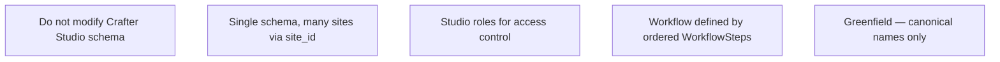
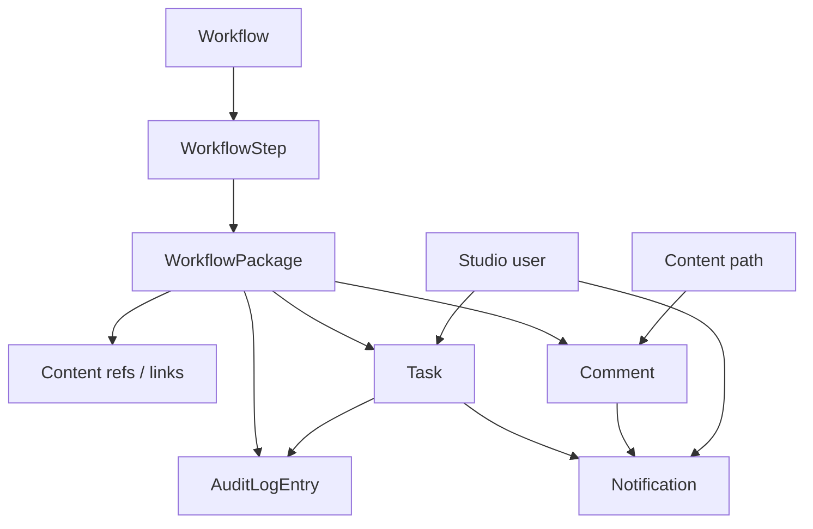

# Crafter Workflow — Design Documentation

Design and implementation reference for the first-party **`crafter-workflow`** database and service layer inside the Studio plugin (`org.rd.plugin.crafterwf`).

These documents describe **what** the system does and **how** it is structured. **All diagrams use [Mermaid](https://mermaid.js.org/).**

## Documents

| Document | Description |
|----------|-------------|
| [CANONICAL_MODEL.md](./CANONICAL_MODEL.md) | **Authoritative glossary** — core entities and deferred features |
| [WORKFLOW_DEFINITIONS.md](./WORKFLOW_DEFINITIONS.md) | Workflow/step definitions in site repo JSON vs runtime DB state |
| [FUNCTIONAL_SPEC.md](./FUNCTIONAL_SPEC.md) | Behavior, Studio UI widgets, and CrafterCMS integration |
| [DATABASE_SCHEMA.md](./DATABASE_SCHEMA.md) | MariaDB schema `crafter-workflow`, ER diagrams, migrations |
| [ARCHITECTURE_DIAGRAM.md](./ARCHITECTURE_DIAGRAM.md) | Stack, domain, services, widgets, migrations |
| [API_CONTRACT.md](./API_CONTRACT.md) | Plugin REST API — endpoints and payloads |
| [AUTHORIZATION.md](./AUTHORIZATION.md) | Studio site roles (no plugin permission tables in current phase) |
| [NOTIFICATIONS.md](./NOTIFICATIONS.md) | In-app notifications (email delivery deferred) |
| [TASKS.md](./TASKS.md) | User tasks, assignees, package linking |
| [AUDIT_LOG.md](./AUDIT_LOG.md) | Append-only audit trail |
| [EXTENSIONS.md](./EXTENSIONS.md) | Cross-cutting features index |
| [GROOVY_SANDBOX.md](./GROOVY_SANDBOX.md) | Studio Groovy sandbox rules and whitelist |
| [POTENTIAL_REQUIREMENTS.md](./POTENTIAL_REQUIREMENTS.md) | Stakeholder requirements + **plugin remediation analysis** |
| [../scripts/tests/README.md](../scripts/tests/README.md) | curl API test suite (all REST endpoints) |

## Design principles

1. **Do not modify Crafter Studio schema** — all plugin data lives in schema `` `crafter-workflow` ``.
2. **Single schema, many sites** — row-level isolation via `site_id`.
3. **Studio roles for access control** — no plugin permission tables in the current phase.
4. **Workflow defined by steps** — **WorkflowSteps** are ordered columns on a **Workflow**.
5. **Greenfield rewrite** — canonical MariaDB-backed API only; legacy Trello/card/board REST shims have been removed.

## Current domain model

| Entity | Meaning |
|--------|---------|
| **Workflow** | Named editorial process; definition in `/config/studio/workflow/definitions/*.workflow.json` |
| **WorkflowStep** | Ordered kanban column (in definition JSON); packages sit in one step at a time |
| **WorkflowPackage** | Unit of work: content refs, links, comments, tasks |
| **Comment** | Thread on a package or content path; step snapshot for package comments |
| **Task** | Assignable to-do with optional target link |
| **Notification** | In-app alert to a Studio user |
| **AuditLogEntry** | Append-only record of task/package actions |

**Deferred:** WorkflowRole (DB tables), WorkflowHook, email notification delivery. Step **roleRule** / **contentRule** live in definition JSON — see [WORKFLOW_DEFINITIONS.md](./WORKFLOW_DEFINITIONS.md).

See [CANONICAL_MODEL.md](./CANONICAL_MODEL.md) and [ARCHITECTURE_DIAGRAM.md](./ARCHITECTURE_DIAGRAM.md).

## Implemented capabilities (summary)

| Area | Status |
|------|--------|
| Kanban board (workflows, steps, packages) | ✅ |
| Content/link attachments, Crafter publish/review | ✅ |
| Generic comments (package + content), @mentions | ✅ |
| In-app notifications + bell widget | ✅ |
| Tasks panel + package tasks | ✅ |
| Audit log + Project Tools tab | ✅ |
| Project Tools workflow admin | ✅ |
| Step role/content rules (JSON) | ✅ |
| Step publish actions on package move | ✅ |
| Package due dates / site calendar | ✅ |
| Email notifications / preferences UI | ❌ deferred |
| Per-workflow RBAC tables, Groovy hooks | ❌ deferred |

## Schema version

Current migration target: **V012**. Check status via **Project Tools → General → Schema status**, or `admin/schema/status.json` (returns `{ installed, schemaName, version }`).
