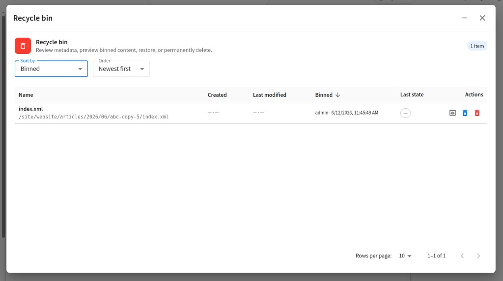

# Recycle Bin

Soft-delete for sandbox content: items are **moved** under `/recyclebin/{uuid}/…` in the site repository and tracked in MariaDB. Authors with **write permission on `/recyclebin`** can use the toolbar and REST API.

## Repository layout

| Path | Purpose |
|------|---------|
| `/recyclebin/` | Root folder (created on first bin operation) |
| `/recyclebin/{uuid}/…` | One bin operation per UUID; original path suffix is preserved |

Example: moving `/site/website/about/index.xml` creates:

```
/recyclebin/a1b2c3d4-…/site/website/about/index.xml
```

Any sandbox item may be binned: pages, components, templates, scripts, static assets, folders, etc.

## Database: `wf_recycle_bin_item` (schema **V013** + **V014**)

| Column | Type | Description |
|--------|------|-------------|
| `id` | CHAR(36) | Primary key; matches the UUID folder name |
| `site_id` | VARCHAR(255) | Crafter site |
| `bin_path` | VARCHAR(1024) | Full sandbox path after move |
| `internal_name` | VARCHAR(512) | Display name at bin time |
| `original_path` | VARCHAR(1024) | Path before binning |
| `original_last_modifier` | VARCHAR(255) | Last editor username snapshot |
| `original_modified_on` | DATETIME | Last modified timestamp snapshot |
| `original_created_on` | DATETIME | Created timestamp snapshot |
| `original_created_by` | VARCHAR(255) | Creator username snapshot (**V014**) |
| `original_sandbox_state` | VARCHAR(64) | Sandbox state at bin time, e.g. `live`, `new` (**V014**) |
| `state` | VARCHAR(32) | `binned` \| `restored` \| `purged` |
| `binned_on` | DATETIME | When item was binned |
| `binned_by_user_id` | BIGINT | Studio user id |
| `binned_by_username` | VARCHAR(255) | Username snapshot |
| `restored_on` | DATETIME | When restored (nullable) |
| `restored_by_user_id` | BIGINT | Restoring user id (nullable) |
| `restored_by_username` | VARCHAR(255) | Restoring username (nullable) |
| `purged_on` | DATETIME | When permanently deleted (**V014**) |
| `purged_by_user_id` | BIGINT | Purging user id (**V014**) |
| `purged_by_username` | VARCHAR(255) | Purging username (**V014**) |

## Authorization

Uses **Crafter Studio content permissions** on `/recyclebin` (no plugin permission tables). Requires **`content_write`** (or matching `.*` permission mapping); site admins always allowed.

| Action | Required permission |
|--------|---------------------|
| See toolbar / call recycle-bin API | **`content_write`** on `/recyclebin` (regex rules like `.*` apply via Studio permission mappings; site admins always allowed) |
| Bin an item | `content_write` on `/recyclebin` **and** `content_delete` or `content_write` on the **source** path |
| Restore | Write on `/recyclebin` |
| Permanently delete (purge) | Write on `/recyclebin` **and** `content_delete` on the **binned** path |

Configure in site **Permission Mappings** so editorial roles have `Write` on `/recyclebin` and `/recyclebin/*`. Users without access do not see the toolbar button.

## Studio UI



Preview toolbar widget **`org.rd.plugin.crafterwf.recycleBinToolbarButton`** (Recycle bin icon) with menu:

| Menu item | Behavior |
|-----------|----------|
| **Put current page in recycle bin** | Bins the content path open in preview; confirmation dialog |
| **Select items to put in recycle bin** | Multi-select dialog (search + recent activity); confirmation before binning |
| **Open recycle bin** | Modal dialog with sortable, paginated table of binned items |

Recycle bin dialog columns and actions:

| Column / control | Description |
|------------------|-------------|
| **Name** | Internal name + original path |
| **Created** | `original_created_by` + `original_created_on` |
| **Last modified** | `original_last_modifier` + `original_modified_on` |
| **Binned** | `binned_by_username` + `binned_on` |
| **Last state** | Sandbox state chip at bin time (`original_sandbox_state`) |
| **Filter** | Keyword search across name, paths, users, sandbox state, and date strings |
| **Sort / order** | Sort by name, created, last modified, or binned; asc/desc |
| **Pagination** | 5 / 10 / 25 / 50 rows per page |
| **Preview** | Opens binned content in Studio preview |
| **Restore** | Move back to `original_path` |
| **Delete permanently** | Removes sandbox content under `bin_path`; row `state=purged` |

Restore checks for **path collisions**. If `original_path` already exists, the user must confirm overwrite in a dialog before restore proceeds.

Permanent delete requires confirmation. Older binned rows (before V014) may show empty created-by or sandbox state.

## REST API

Base: `/studio/api/2/plugin/script/plugins/org/rd/plugin/crafterwf/crafterwf/recycle-bin/`

| Endpoint | Description |
|----------|-------------|
| `can-access.json?siteId=` | `{ allowed: boolean }` — for hiding toolbar |
| `list.json?siteId=&state=binned&page=1&pageSize=10&sortBy=binnedOn&sortOrder=desc&q=` | Paginated list: `{ items, total, page, pageSize, totalPages }`; `q` filters name, paths, users, state, dates |
| `bin.json?siteId=&paths=/a,/b` | Move one or more paths to recycle bin |
| `check-restore.json?siteId=&id=` | `{ collision: boolean, existingPath?: string }` |
| `restore.json?siteId=&id=&confirmCollision=true` | Restore item to `original_path` |
| `purge.json?siteId=&id=` | Permanently delete binned sandbox content; row `state=purged` |

**`sortBy` values:** `binnedOn`, `internalName`, `originalPath`, `originalModifiedOn`, `originalCreatedOn`, `originalLastModifier`, `binnedByUsername`

All endpoints require authenticated Studio session and recycle-bin write access.

## Side effects

When content is binned:

- Sandbox item is moved via Studio **`cstudioContentService.moveContent`** (real repository move, not a DB-only flag)
- Only `/recyclebin` and `/recyclebin/{uuid}` folders are pre-created — the mirrored path is created by `moveContent` so page folders are not duplicated
- Active **workflow package** content refs for that path are removed
- Audit entry `recycle_bin_item_binned` is recorded
- Studio sidebar refreshes via `MOVE_CONTENT_EVENT` after a successful bin/restore

When restored:

- Item is moved back to `original_path`
- Row `state` becomes `restored`
- Audit entry `recycle_bin_item_restored`
- Studio sidebar refreshes via `MOVE_CONTENT_EVENT`

When purged:

- Sandbox content under `bin_path` is deleted via Studio `contentService.deleteContent`
- Row `state` becomes `purged` with `purged_on` / `purged_by_*`
- Audit entry `recycle_bin_item_purged`
- Studio sidebar refreshes via `DELETE_CONTENT_EVENT`

## Test plan

### API (curl / `scripts/run-api-tests.sh`)

| # | Test | Expected |
|---|------|----------|
| T1 | `can-access` as user **without** `/recyclebin` write | `{ allowed: false }` |
| T2 | `can-access` as user **with** write or site admin | `{ allowed: true }` |
| T3 | `list` on empty site | `{ items: [] }` |
| T4 | `bin` test page path | `{ items: [{ id, binPath, originalPath, state: 'binned' }] }`; sandbox file under `/recyclebin/{uuid}/…` |
| T5 | `bin` same path again (already binned) | Error or skip |
| T6 | `bin` without source permission | 403 / error message |
| T7 | `list` after bin | Item appears with metadata |
| T8 | `check-restore` when original missing | `{ collision: false }` |
| T9 | `restore` to empty original path | Item at original path; row `state=restored` |
| T10 | `check-restore` when original exists | `{ collision: true }` |
| T11 | `restore` without `confirmCollision` when collision | Error |
| T12 | `restore` with `confirmCollision=true` | Overwrites/moves; success |
| T13 | Package had content ref → after bin, ref removed | `workflow-package/get` or board |
| T14 | `list` with `page`, `pageSize`, `sortBy`, `sortOrder` | Correct slice and ordering |
| T15 | `purge` binned item | Sandbox file gone; row `state=purged` |
| T16 | `list` after purge | Item no longer in `state=binned` list |

### UI (manual)

| # | Scenario |
|---|----------|
| U1 | User without permission: no recycle bin toolbar button |
| U2 | Put current page → confirm → page gone from tree; appears in bin dialog |
| U3 | Select multiple items → bin → all moved |
| U4 | Open recycle bin → restore → content back in site tree |
| U5 | Restore collision → dialog → cancel vs confirm |
| U6 | Sort columns and change page size → table updates |
| U7 | Preview button → binned content opens in preview |
| U8 | Delete permanently → confirm → item removed from bin and sidebar |

### Schema

| # | Test |
|---|------|
| S1 | Fresh install / migrate → V013 + V014, `wf_recycle_bin_item` exists |
| S2 | Project Tools → General shows schema version 14 |

## Related documents

- [API_CONTRACT.md](./API_CONTRACT.md)
- [DATABASE_SCHEMA.md](./DATABASE_SCHEMA.md)
- [AUTHORIZATION.md](./AUTHORIZATION.md)
- [EXTENSIONS.md](./EXTENSIONS.md)
