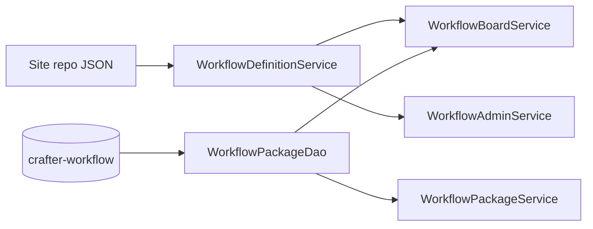

# Workflow definitions (site repository)

Workflow **definitions** (metadata and ordered steps) live in the site sandbox as version-controlled JSON. **Runtime state** (packages, positions, comments, tasks, audit) stays in the MariaDB schema `` `crafter-workflow` ``.

## Storage split

| Layer | Location | Contents |
|-------|----------|----------|
| **Definition** | `/config/studio/workflow/definitions/{workflowId}.workflow.json` | Workflow name, description, background, default flag, ordered steps (colors, publish actions, step rules) |
| **State** | `` `crafter-workflow` `` tables | `wf_workflow_package` and related rows; `workflow_id` / `workflow_step_id` reference definition IDs |



## File layout

| Path | Description |
|------|-------------|
| `/config/studio/workflow/definitions/` | Folder for all workflow definition files (created on first save if missing) |
| `{workflowId}.workflow.json` | One file per workflow; `workflowId` must match the `id` field inside the file |

Shipped example (plugin `authoring/` tree):

```
authoring/config/studio/workflow/definitions/editorial.workflow.json
```

`./scripts/install-plugin.sh` copies `authoring/config/studio/workflow/definitions/*.workflow.json` into the site sandbox. Commit those files in Studio (or git) so all environments share the same workflows.

## JSON schema

Root object:

| Field | Type | Required | Description |
|-------|------|----------|-------------|
| `id` | string | yes | Stable workflow ID (slug); must match filename |
| `name` | string | yes | Display name |
| `description` | string | no | Optional description |
| `backgroundUrl` | string | no | Board background token or URL |
| `position` | number | no | Sort order in admin list (default `0`) |
| `isDefault` | boolean | no | Default board when `workflowId` is omitted |
| `steps` | array | yes | Ordered workflow steps |

Each step object:

| Field | Type | Required | Description |
|-------|------|----------|-------------|
| `id` | string | yes | Stable step ID (slug), stored on packages as `workflow_step_id` |
| `name` | string | yes | Column title on the board |
| `position` | number | no | Sort order (admin saves `(index + 1) * 1000`) |
| `color` | string | no | Column color token (default `blue`) |
| `isTerminal` | boolean | no | Marks a “done” column |
| `allowAddPackage` | boolean | no | Whether new packages can be created in this step |
| `actionType` | string | no | Publish action: `none`, `request_publish_staging`, `request_publish_live`, `publish_staging`, `publish_live` |
| `actionSuccessStepId` | string | no | Step to move package to after a successful action |
| `roleRule` | object | no | Who may move packages into this step (`mode`: `all` \| `include` \| `exclude`, `roles`: string[]) |
| `contentRule` | object | no | Content constraints (`mode`: `all` \| `any`, `pathPatterns`, `contentTypes`) |

Example (abbreviated):

```json
{
  "id": "editorial",
  "name": "Editorial Workflow",
  "isDefault": true,
  "steps": [
    {
      "id": "backlog",
      "name": "Backlog",
      "position": 1000,
      "allowAddPackage": true,
      "actionType": "none",
      "roleRule": { "mode": "all", "roles": [] },
      "contentRule": { "mode": "all", "pathPatterns": [], "contentTypes": [] }
    }
  ]
}
```

## Service behavior

- **`WorkflowDefinitionService`** — Reads/writes definitions via Studio `contentService` (`write`, `getContentByCommitId`, `getChildItems`, `createFolder`, `deleteContent`).
- **`WorkflowAdminService`** — Lists, creates, updates, and deletes definitions (no writes to `wf_workflow` / `wf_workflow_step`).
- **`WorkflowBoardService`** — Loads board columns from JSON; packages still come from `wf_workflow_package`.
- **Package rows** — `workflow_id` and `workflow_step_id` store definition slugs (e.g. `editorial`, `backlog`), not DB-generated UUIDs.

## Legacy database tables

`wf_workflow` and `wf_workflow_step` remain in the schema from earlier migrations but are **not** used for definition CRUD. New sites should rely on JSON only. Existing DB-only definitions can be recreated in Project Tools or copied into JSON files manually.

## Related documents

- [CANONICAL_MODEL.md](./CANONICAL_MODEL.md)
- [DATABASE_SCHEMA.md](./DATABASE_SCHEMA.md)
- [ARCHITECTURE_DIAGRAM.md](./ARCHITECTURE_DIAGRAM.md)
- [API_CONTRACT.md](./API_CONTRACT.md)
- [GROOVY_SANDBOX.md](./GROOVY_SANDBOX.md) — `contentService` whitelist entries
