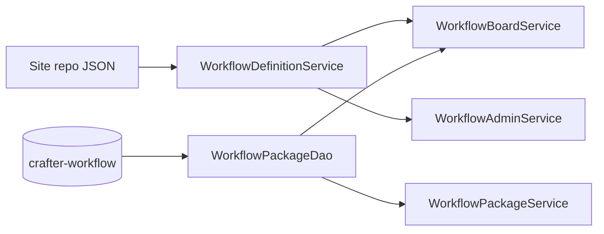
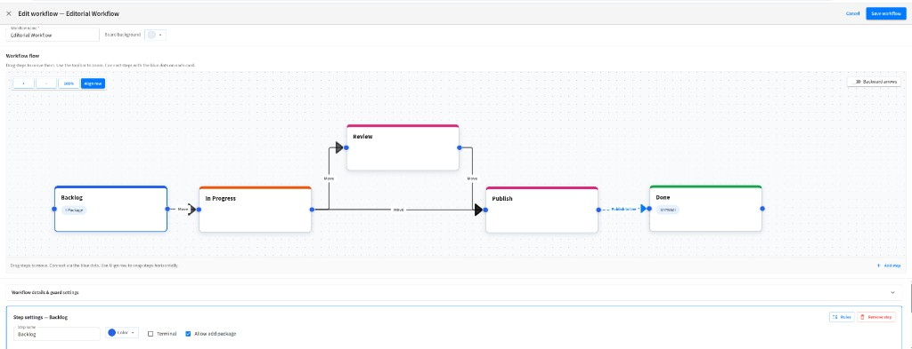

# Workflow definitions (site repository)

Workflow **definitions** (metadata and ordered steps) live in the site sandbox as version-controlled JSON. **Runtime state** (packages, positions, comments, tasks, audit) stays in the MariaDB schema `` `crafter-workflow` ``.

## Storage split

| Layer | Location | Contents |
|-------|----------|----------|
| **Definition** | `/config/studio/workflow/definitions/{workflowId}.workflow.json` | Workflow name, description, background, default flag, ordered steps (colors, publish actions, step rules) |
| **State** | `` `crafter-workflow` `` tables | `wf_workflow_package` and related rows; `workflow_id` / `workflow_step_id` reference definition IDs |



## File layout

| Path | Description |
|------|-------------|
| `/config/studio/workflow/definitions/` | Folder for all workflow definition files (created on first save if missing) |
| `{workflowId}.workflow.json` | One file per workflow; `workflowId` must match the `id` field inside the file |

Shipped example (plugin `authoring/` tree):

```
authoring/config/studio/workflow/definitions/editorial.workflow.json
```

`./scripts/install-plugin.sh` copies `authoring/config/studio/workflow/definitions/*.workflow.json` into the site sandbox. Commit those files in Studio (or git) so all environments share the same workflows.

## JSON schema

Root object:

| Field | Type | Required | Description |
|-------|------|----------|-------------|
| `id` | string | yes | Stable workflow ID (slug); must match filename |
| `name` | string | yes | Display name |
| `description` | string | no | Optional description |
| `backgroundUrl` | string | no | Board background token or URL |
| `position` | number | no | Sort order in admin list (default `0`) |
| `isDefault` | boolean | no | Default board when `workflowId` is omitted |
| `steps` | array | yes | Ordered workflow steps |
| `createListeners` | array | no | Content **create** event listeners (see below) |
| `editListeners` | array | no | Content **edit** event listeners (see below) |
| `flowLayout` | object | no | React Flow node positions keyed by step id (see [Workflow flow editor](#workflow-flow-editor)) |
| `flowViewport` | object | no | Saved canvas pan/zoom for the flow editor (`x`, `y`, `zoom`) |

Each step object:

| Field | Type | Required | Description |
|-------|------|----------|-------------|
| `id` | string | yes | Stable step ID (slug), stored on packages as `workflow_step_id` |
| `name` | string | yes | Column title on the board |
| `position` | number | no | Sort order (admin saves `(index + 1) * 1000`) |
| `color` | string | no | Column color token (default `blue`) |
| `isTerminal` | boolean | no | Marks a “done” column |
| `allowAddPackage` | boolean | no | Whether new packages can be created in this step |
| `actionType` | string | no | Publish action: `none`, `request_publish_staging`, `request_publish_live`, `publish_staging`, `publish_live` |
| `actionSuccessStepId` | string | no | Step to move package to after a successful action |
| `roleRule` | object | no | Who may move packages into this step (`mode`: `all` \| `include` \| `exclude`, `roles`: string[]) |
| `contentRule` | object | no | Content constraints (`mode`: `all` \| `any`, `pathPatterns`, `contentTypes`) |
| `transitionStepIds` | string[] | no | Step ids a package may be **manually dragged to** from this step on the board (see [Manual move transitions](#manual-move-transitions)) |

### Content event listeners

Workflow definitions may declare `createListeners` and `editListeners`. Each listener runs when Studio saves content that matches its filters. **Create listeners** run on `NEW`, `DUPLICATE`, and `COPY` lifecycle operations (duplicate/paste create new content items). When `editListeners` is empty, **create listeners also run on content edit/save** (Studio fires an UPDATE lifecycle event on every save).

| Field | Type | Required | Description |
|-------|------|----------|-------------|
| `id` | string | no | Stable listener id (auto-generated on save if omitted) |
| `contentType` | string | no | Content type path (e.g. `/page/page_generic`); empty = any type |
| `pathRegex` | string | no | Java regex against the content path; empty = any path |
| `packageNamePrefix` | string | yes | Prefix for auto-created package titles |
| `stepId` | string | yes | Target workflow step id |

**Action (per matching listener):**

1. Find an active package in this workflow that already contains the content path, or whose title matches `{packageNamePrefix}{displayName}`.
2. If none exists, create a package in `stepId` (bypasses `allowAddPackage`) and attach the content item.
3. If the package is not already in `stepId`, move it there (step publish actions run on move).

Listeners are configured in **Project Tools → Workflows → Edit workflow → Content event listeners** (Create / Edit tabs).

**Runtime wiring (server only):** Studio runs each content type’s stock `controller.groovy`, which calls `CommonLifecycleApi.execute()`. `./scripts/install-plugin.sh` installs a patched `CommonLifecycleApi.groovy` and `CrafterwfWorkflowLifecycleBridge.groovy` under Studio **`default-site/scripts/libs/`** (the lifecycle Groovy classpath). That hook delegates to the plugin’s `WorkflowContentEventService` — no browser/client involvement. The install script also **normalizes** site `controller.groovy` files back to stock (removes legacy per-controller bridge patches). **Restart authoring Tomcat** after install so lifecycle classes reload. **Commit the site** if controllers were normalized.

**Logs:** every save/duplicate prints `[crafterwf] CommonLifecycleApi op=...` and `[crafterwf] lifecycle site=...` to `catalina.out`. Enrollment logs `[crafterwf] bridge event...` and SLF4J `Workflow lifecycle event:` / `Processing workflow content event:`.

Example listener block:

```json
"createListeners": [
  {
    "id": "pages-backlog",
    "contentType": "/page/page_generic",
    "pathRegex": "^/site/website/.*",
    "packageNamePrefix": "Page: ",
    "stepId": "backlog"
  }
],
"editListeners": []
```

Example (abbreviated):

```json
{
  "id": "editorial",
  "name": "Editorial Workflow",
  "isDefault": true,
  "steps": [
    {
      "id": "backlog",
      "name": "Backlog",
      "position": 1000,
      "allowAddPackage": true,
      "actionType": "none",
      "roleRule": { "mode": "all", "roles": [] },
      "contentRule": { "mode": "all", "pathPatterns": [], "contentTypes": [] }
    }
  ]
}
```

## Step publish actions

Steps may set `actionType` and optional `actionSuccessStepId`. When a package is **moved into** that step, `WorkflowStepActionService` runs the action against all **content attachments** on the package.

**Important:** Actions delegate to Crafter Studio’s `workflowService` and run **as the user who moved the package**. They are not a custom publish path — permissions, validation, environment targets, and notifications behave **exactly as in stock Studio** (request-publish vs direct publish, staging vs live, etc.). See [FUNCTIONAL_SPEC.md § Publishing](./FUNCTIONAL_SPEC.md#publishing-and-crafter-studio-workflow).

| `actionType` | When it runs | On success |
|--------------|--------------|------------|
| `none` | — | Package stays in entered step |
| `request_publish_staging` / `request_publish_live` | After move into step | Optional move to `actionSuccessStepId` |
| `publish_staging` / `publish_live` | After move into step | Optional move to `actionSuccessStepId` |

On failure (no attachments, staging disabled, publish error), the package may revert to the previous step and the user sees the Studio error message. An audit entry records `package_step_action`.

**Server logs (`[crafterwf]`):**

| Log | Meaning |
|-----|---------|
| `Invoking Studio workflowService.requestPublish` / `publish` | Step action started (lists target env, path count, package id) |
| `Step action … completed … Crafter Studio OOTB may queue publish/review emails via EmailMessageSender` | Action succeeded; OOTB review mail is **not** plugin mail |
| `Step action … succeeded … but no success step is configured` | `actionSuccessStepId` empty — package stays on the action step |
| `Step action … failed` | Publish/request failed; package may revert |

Configure step actions in **Project Tools → Workflows → Edit workflow →** per-step **Publish action** and optional **Success step** (workflow editor).

## Workflow flow editor



**Project Tools → Workflows → Edit workflow** includes a visual **flow diagram** (React Flow) for arranging steps and defining how packages may move between columns on the kanban board.

The kanban board authors use day-to-day is separate from this admin diagram — see [FUNCTIONAL_SPEC.md § C1](./FUNCTIONAL_SPEC.md#c1--workflow-board-presentation).

### Canvas controls

| Control | Purpose |
|---------|---------|
| **Drag steps** | Reposition nodes on the canvas; positions are saved in `flowLayout` when you click **Save workflow** |
| **Blue connection handles** | Draw **Move** arrows between steps; saved as `transitionStepIds` on the source step |
| **Zoom (+ / − / 100%)** | Adjust canvas zoom; pan by dragging the background |
| **Align row** | Snap all steps to a single horizontal row (useful after adding steps) |
| **Backward arrows** | Toggle (default **off**): when on, shows dashed amber **Move (back)** edges for transitions where the target step appears earlier in the workflow; display-only — does not change saved data |
| **+ Add step** | Append a new step; select a node to edit name, color, terminal flag, and rules in the panel below |

Dashed edges labeled **Publish to Live** (or similar) represent **step publish actions** (`actionType`), not manual Move transitions. They are configured per step in the settings panel, not by connecting handles.

### Manual move transitions

Each step may list `transitionStepIds`: the step ids packages are allowed to reach when an author **drags a card** on the board from that column.

| `transitionStepIds` | Board behavior |
|---------------------|----------------|
| **Omitted or empty** | Legacy behavior — packages may be dragged to any step (subject to role/content rules) |
| **Non-empty array** | Only listed target steps accept drops from this source; other columns are disabled while dragging |

The server enforces the same rules in `WorkflowPackageService` when a move is submitted via REST. **Save workflow** after editing arrows so the board picks up changes.

Example step with explicit transitions:

```json
{
  "id": "in-progress",
  "name": "In Progress",
  "transitionStepIds": ["review", "publish"]
}
```

### Persisted layout and viewport

When you save a workflow from the editor, optional root-level fields store the diagram state:

```json
{
  "flowLayout": {
    "backlog": { "x": 0, "y": 120 },
    "in-progress": { "x": 280, "y": 120 },
    "review": { "x": 560, "y": 40 },
    "publish": { "x": 840, "y": 120 },
    "done": { "x": 1120, "y": 120 }
  },
  "flowViewport": {
    "x": 12,
    "y": 8,
    "zoom": 1
  }
}
```

| Field | Type | Description |
|-------|------|-------------|
| `flowLayout` | `{ [stepId]: { x, y } }` | Node positions in flow-editor coordinates |
| `flowViewport` | `{ x, y, zoom }` | Last canvas pan and zoom (zoom clamped 0.5–1.75 on load) |

On open, saved positions merge with defaults for any new steps that lack entries. Step **order on the board** still follows each step’s `position` field; `flowLayout` affects the admin diagram only.

## Workflow bypass guard

When a workflow has at least one action step (`actionType` ≠ `none`), Studio **publish**, **request publish**, and **reject** actions on attached content are intercepted if the package is **not** on one of those steps. See [WORKFLOW_BYPASS_GUARD.md](./WORKFLOW_BYPASS_GUARD.md).

| Field | Type | Description |
|-------|------|-------------|
| `allowUiBypass` | boolean | Default `false`. When true, Studio publish/reject off-step shows an acknowledgement dialog; when false, the action is blocked in the UI. |
| `bypassWarningMessage` | string | Optional custom text in the guard dialog (workflow root). Empty = plugin default (wording depends on `allowUiBypass`). |

## Service behavior

- **`WorkflowDefinitionService`** — Reads/writes definitions via Studio `contentService` (`write`, `getContentByCommitId`, `getChildItems`, `createFolder`, `deleteContent`).
- **`WorkflowAdminService`** — Lists, creates, updates, and deletes definitions (no writes to `wf_workflow` / `wf_workflow_step`).
- **`WorkflowBoardService`** — Loads board columns from JSON; packages still come from `wf_workflow_package`.
- **Package rows** — `workflow_id` and `workflow_step_id` store definition slugs (e.g. `editorial`, `backlog`), not DB-generated UUIDs.

## Legacy database tables

`wf_workflow` and `wf_workflow_step` remain in the schema from earlier migrations but are **not** used for definition CRUD. New sites should rely on JSON only. Existing DB-only definitions can be recreated in Project Tools or copied into JSON files manually.

## Related documents

- [CANONICAL_MODEL.md](./CANONICAL_MODEL.md)
- [DATABASE_SCHEMA.md](./DATABASE_SCHEMA.md)
- [ARCHITECTURE_DIAGRAM.md](./ARCHITECTURE_DIAGRAM.md)
- [API_CONTRACT.md](./API_CONTRACT.md)
- [GROOVY_SANDBOX.md](./GROOVY_SANDBOX.md) — `contentService` whitelist entries
